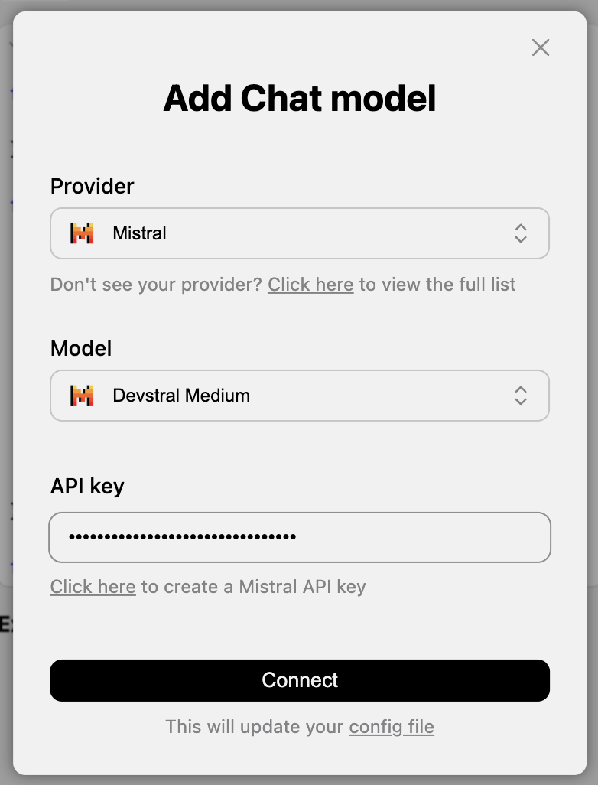

# Continue + Mistral — Setup Guide

> How to configure the [Continue](https://www.continue.dev/) AI coding assistant in Visual Studio Code with [Mistral AI](https://mistral.ai/) models — using Continue's built-in setup dialog (no manual config editing required).
> Anleitung zur Einrichtung des [Continue](https://www.continue.dev/)-AI-Coding-Assistenten in Visual Studio Code mit [Mistral AI](https://mistral.ai/)-Modellen — über den eingebauten Einrichtungsdialog von Continue (ohne manuelles Bearbeiten der Konfigurationsdatei).

---

## 🇬🇧 English

### What is Continue?

[Continue](https://www.continue.dev/) is an open-source AI assistant for Visual Studio Code (and JetBrains). It adds:

- **Chat** — ask questions about your code in a side panel
- **Tab autocomplete** — inline code suggestions while you type
- **Edit** — select code and ask the AI to refactor or modify it (`⌘I`)
- **Agent** — let the AI make multi-step changes across files

Continue is *bring-your-own-model*: you choose the LLM provider. This guide uses **Mistral**, which offers fast European-hosted models including [Devstral](https://mistral.ai/news/devstral/) — a model tuned for software engineering tasks.

### Why Mistral?

- **European provider** (Paris-based) — data is processed under EU/GDPR rules
- **Devstral** is tuned for coding tasks and integrates directly into Continue's setup dialog
- Free tier available on the [La Plateforme](https://console.mistral.ai/) API

### Step 1 — Install the Continue extension

Continue is already listed as a recommended extension for this project. To install it:

1. Open **Visual Studio Code**.
2. Open this project folder (`Empty Sketch`).
3. When VS Code shows the prompt *"This workspace has extension recommendations"*, click **Install All**.

Alternatively, install it manually from the marketplace: [`continue.continue`](https://marketplace.visualstudio.com/items?itemName=continue.continue).

After installation, the Continue icon appears in the left sidebar of VS Code.

### Step 2 — Create a Mistral API key

1. Go to [https://console.mistral.ai/](https://console.mistral.ai/) and sign up (free).
2. Verify your email address.
3. In the left menu, open **API Keys**.
4. Click **Create new key**, give it a name (e.g. *"Continue VS Code"*), and copy the key.
5. **Store the key somewhere safe** — Mistral will only show it once.

> 💡 Tip: from the Continue dialog (see next step) you can also click *"Click here to create a Mistral API key"* — it links directly to the same page.

### Step 3 — Connect Mistral through Continue's setup dialog

Continue ships with a built-in dialog that wires up the provider, model, and API key for you. **You do not need to edit `config.yaml` manually.**

1. Open the **Continue panel** in VS Code (click the Continue icon in the sidebar).
2. At the top of the panel, click the model selector → **+ Add Chat model** (or open the assistant settings and choose *Add model*).
3. The **"Add Chat model"** dialog appears (see screenshot in [`.vscode/continue.png`](./.vscode/continue.png)):

   

4. Fill in the dialog:
   - **Provider** → select **Mistral** from the dropdown.
   - **Model** → select **Devstral Medium** (recommended for coding). Other good options: *Mistral Large* for general chat, *Mistral Small* for faster/cheaper replies.
   - **API key** → paste the key you created in Step 2.
5. Click **Connect**.

That's it. Continue writes the new entry into its config file automatically. The message at the bottom of the dialog (*"This will update your config file"*) confirms this.

### Step 4 — (Optional) Add an autocomplete model

The dialog above sets up the **chat** model. To also get inline tab completions, add a second model:

1. Open the model selector again.
2. Choose **+ Add Autocomplete model** (or *Add model* → set role to *Autocomplete*).
3. **Provider** → **Mistral**.
4. **Model** → **Codestral** (Mistral's dedicated code-completion model).
5. Paste the same API key → **Connect**.

### Step 5 — Try it out

1. **Chat**: open the Continue panel and ask *"Explain what `draw()` does in p5.js."*
2. **Autocomplete** (if configured): open `sketch.js`, place the cursor inside `draw()`, type `ell` — Codestral should suggest `ellipse(...)`. Press **Tab** to accept.
3. **Edit**: select a few lines in `sketch.js`, press **⌘I** (macOS) or **Ctrl+I** (Windows/Linux), and type an instruction such as *"add a circle in the centre of the canvas"*.

### Switching or removing models

- **Switch model**: click the model name at the top of the Continue panel and pick another configured model.
- **Remove a model**: open the Continue settings (gear icon) → *Models* → click the trash icon next to the entry.
- **Replace the API key**: re-run the *Add Chat model* dialog with the same provider+model and paste a new key, or edit it in the settings UI.

If you ever do want to inspect what Continue wrote, the file lives at `~/.continue/config.yaml`. You should not need to touch it for this setup.

### Useful Continue keyboard shortcuts

| Action | macOS | Windows / Linux |
|--------|-------|------------------|
| Open Continue chat | `⌘L` | `Ctrl+L` |
| Send selected code to chat | `⌘L` (with selection) | `Ctrl+L` |
| Inline edit | `⌘I` | `Ctrl+I` |
| Accept autocomplete suggestion | `Tab` | `Tab` |
| Reject autocomplete suggestion | `Esc` | `Esc` |

### Security note 🔐

Your API key is stored in `~/.continue/config.yaml` in your home directory — **not** inside this project — so it will not be committed to git by accident. Never paste your key into a file inside the project folder, and never share screenshots of the key.

### Troubleshooting

- **"Invalid API key"** — make sure the key was copied completely (no leading/trailing spaces). Re-run the *Add Chat model* dialog and paste again.
- **Mistral not in the provider list** — update the Continue extension to the latest version.
- **Autocomplete not appearing** — ensure VS Code's `editor.inlineSuggest.enabled` is `true` and that no other extension (Copilot, etc.) is competing.
- **Slow responses** — switch to *Mistral Small* in the model selector; it is significantly faster.
- **Rate-limit errors** — the free tier has request limits. Wait a moment and try again, or add a payment method on the Mistral console.

---

## 🇩🇪 Deutsch

### Was ist Continue?

[Continue](https://www.continue.dev/) ist ein quelloffener KI-Assistent für Visual Studio Code (und JetBrains). Er bietet:

- **Chat** — Fragen zum Code in einem Seitenpanel stellen
- **Tab-Autovervollständigung** — Inline-Vorschläge beim Tippen
- **Edit** — Code auswählen und von der KI umschreiben lassen (`⌘I`)
- **Agent** — die KI nimmt mehrstufige Änderungen über mehrere Dateien hinweg vor

Continue ist *bring-your-own-model*: Du wählst den LLM-Anbieter selbst. Diese Anleitung verwendet **Mistral** — schnelle, in Europa gehostete Modelle inklusive [Devstral](https://mistral.ai/news/devstral/), einem auf Software-Entwicklung abgestimmten Modell.

### Warum Mistral?

- **Europäischer Anbieter** (Paris) — Daten werden gemäss EU-/DSGVO-Recht verarbeitet
- **Devstral** ist auf Coding-Aufgaben optimiert und direkt im Continue-Einrichtungsdialog auswählbar
- Kostenloses Kontingent auf der [La-Plateforme-API](https://console.mistral.ai/)

### Schritt 1 — Continue-Erweiterung installieren

Continue ist bereits als empfohlene Erweiterung für dieses Projekt eingetragen. Installation:

1. **Visual Studio Code** öffnen.
2. Diesen Projektordner (`Empty Sketch`) öffnen.
3. Bei der Meldung *„This workspace has extension recommendations"* auf **Install All** klicken.

Alternativ manuell aus dem Marketplace installieren: [`continue.continue`](https://marketplace.visualstudio.com/items?itemName=continue.continue).

Nach der Installation erscheint das Continue-Symbol in der linken Seitenleiste von VS Code.

### Schritt 2 — Mistral-API-Schlüssel erstellen

1. Auf [https://console.mistral.ai/](https://console.mistral.ai/) gehen und kostenlos registrieren.
2. E-Mail-Adresse bestätigen.
3. Im linken Menü **API Keys** öffnen.
4. **Create new key** klicken, einen Namen vergeben (z. B. *„Continue VS Code"*) und den Schlüssel kopieren.
5. **Schlüssel sicher aufbewahren** — Mistral zeigt ihn nur einmal an.

> 💡 Tipp: Im Continue-Dialog (nächster Schritt) gibt es einen Link *„Click here to create a Mistral API key"*, der direkt auf dieselbe Seite führt.

### Schritt 3 — Mistral über den Continue-Einrichtungsdialog verbinden

Continue bringt einen Dialog mit, der Provider, Modell und API-Schlüssel automatisch einträgt. **Die Datei `config.yaml` muss nicht von Hand bearbeitet werden.**

1. **Continue-Panel** in VS Code öffnen (Continue-Symbol in der Seitenleiste).
2. Oben im Panel auf den Modellauswähler klicken → **+ Add Chat model** (oder in den Assistant-Einstellungen *Add model* wählen).
3. Es öffnet sich der Dialog **„Add Chat model"** (siehe Screenshot unter [`.vscode/continue.png`](./.vscode/continue.png)):

   

4. Felder ausfüllen:
   - **Provider** → **Mistral** aus dem Dropdown wählen.
   - **Model** → **Devstral Medium** (empfohlen für Coding). Weitere Optionen: *Mistral Large* für allgemeinen Chat, *Mistral Small* für schnellere/günstigere Antworten.
   - **API key** → den in Schritt 2 erstellten Schlüssel einfügen.
5. Auf **Connect** klicken.

Das war's. Continue trägt den Eintrag automatisch in die Konfigurationsdatei ein. Der Hinweis am unteren Rand des Dialogs (*„This will update your config file"*) bestätigt das.

### Schritt 4 — (Optional) Autovervollständigungs-Modell hinzufügen

Der obige Dialog richtet das **Chat**-Modell ein. Für Inline-Tab-Vervollständigung ein zweites Modell hinzufügen:

1. Modellauswähler erneut öffnen.
2. **+ Add Autocomplete model** wählen (oder *Add model* → Rolle auf *Autocomplete* setzen).
3. **Provider** → **Mistral**.
4. **Model** → **Codestral** (Mistrals spezialisiertes Code-Vervollständigungs-Modell).
5. Denselben API-Schlüssel einfügen → **Connect**.

### Schritt 5 — Ausprobieren

1. **Chat**: Continue-Panel öffnen und fragen: *„Erkläre, was `draw()` in p5.js macht."*
2. **Autovervollständigung** (falls konfiguriert): `sketch.js` öffnen, Cursor in `draw()` platzieren, `ell` tippen — Codestral sollte `ellipse(...)` vorschlagen. Mit **Tab** akzeptieren.
3. **Edit**: Einige Codezeilen in `sketch.js` auswählen, **⌘I** (macOS) bzw. **Strg+I** (Windows/Linux) drücken und eine Anweisung eingeben, etwa *„füge einen Kreis in der Mitte der Leinwand hinzu"*.

### Modell wechseln oder entfernen

- **Modell wechseln**: oben im Continue-Panel auf den Modellnamen klicken und ein anderes konfiguriertes Modell wählen.
- **Modell entfernen**: Continue-Einstellungen (Zahnrad) → *Models* → Papierkorb-Symbol neben dem Eintrag.
- **API-Schlüssel ersetzen**: *Add Chat model*-Dialog mit demselben Provider+Modell erneut aufrufen und neuen Schlüssel eingeben, oder in der Einstellungs-UI ändern.

Falls du dennoch nachsehen möchtest, was Continue geschrieben hat: die Datei liegt unter `~/.continue/config.yaml`. Für die Einrichtung ist das nicht nötig.

### Nützliche Continue-Tastenkürzel

| Aktion | macOS | Windows / Linux |
|--------|-------|------------------|
| Continue-Chat öffnen | `⌘L` | `Strg+L` |
| Markierten Code an Chat senden | `⌘L` (mit Auswahl) | `Strg+L` |
| Inline-Bearbeitung | `⌘I` | `Strg+I` |
| Vorschlag akzeptieren | `Tab` | `Tab` |
| Vorschlag ablehnen | `Esc` | `Esc` |

### Sicherheitshinweis 🔐

Der API-Schlüssel wird in `~/.continue/config.yaml` im Home-Verzeichnis gespeichert — **nicht** im Projektordner — und landet daher nicht versehentlich in Git. Den Schlüssel niemals in eine Datei im Projektordner kopieren und keine Screenshots des Schlüssels weitergeben.

### Fehlerbehebung

- **„Invalid API key"** — Schlüssel vollständig kopiert (ohne führende/nachfolgende Leerzeichen)? *Add Chat model*-Dialog erneut öffnen und neu einfügen.
- **Mistral nicht in der Provider-Liste** — Continue-Erweiterung auf die neueste Version aktualisieren.
- **Keine Autovervollständigung** — `editor.inlineSuggest.enabled` in VS Code muss `true` sein, und keine andere Erweiterung (z. B. Copilot) darf in Konflikt stehen.
- **Langsame Antworten** — im Modellauswähler auf *Mistral Small* wechseln, deutlich schneller.
- **Rate-Limit-Fehler** — das kostenlose Kontingent hat Anfrage-Limits. Kurz warten und erneut versuchen, oder Zahlungsmethode in der Mistral-Konsole hinzufügen.

---

## Resources / Ressourcen

- [Continue Documentation](https://docs.continue.dev/)
- [Continue — Mistral provider docs](https://docs.continue.dev/customize/model-providers/top-level/mistral)
- [Mistral AI Console](https://console.mistral.ai/)
- [Mistral Model Overview](https://docs.mistral.ai/getting-started/models/)
- [Devstral announcement](https://mistral.ai/news/devstral/)
